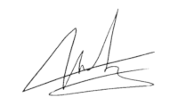

# CONTRAT DE PRET 

## LES SOUSSIGNES :

**AUBRY Manon**, candidate tête de liste aux élections européennes du 9 juin 2024, domiciliée chez
La France Insoumise – 25 passage Dubail – 75010 PARIS,  
**Ci-après dénommée l’emprunteuse**,  
Ayant désigné pour mandataire financier, conformément à la loi 90-55 du 15 janvier 1990 modifiée notamment par la loi du
19 janvier 1995 : L’AFCE LFI 2024, 25 passage Dubail, 75010 Paris,

et

**{{ nom_preteur }}**, né{{ e }} le {{ date_naissance }}, à {{ lieu_naissance }}  
Domicilié{{ e }} au {{ adresse_preteur }}  
**Ci-après dénommé{{ e }} {{ le }} {{ preteur }}**,

## APRES AVOIR PREALABLEMENT EXPOSE CE QUI SUIT :

Le prêt s’inscrit dans le cadre de l’article 26 de la Loi n°2017-1339 du 15 septembre 2017 pour la confiance dans la vie politique modifiant l’article 52-7 du code électoral et relatif aux prêts de personnes physiques à un candidat aux élections.
{{ Le }} {{ preteur }} certifie sur l’honneur qu’{{ il }} n’effectue pas de prêts aux candidats aux élections « à titre habituel ».

## SONT CONVENUS DE CE QUI SUIT :

### Montant du prêt
{{ Le }} {{ preteur }} consent à l'emprunteuse qui l’accepte un prêt d'un montant de {{ amount_letters }} ({{ amount_figure }}) dans les conditions suivantes 

### Mise à disposition
Les sommes prêtées seront versées par {{ le }} {{ preteur }} par {{ mode_paiement }} depuis son compte personnel et
portées au crédit du compte du mandataire financier de la liste : AFCE LFI 2024.
							
### Coût et durée du prêt
Le prêt est consenti sans intérêt et pour une durée maximale de douze mois.

### Défaillance de l'emprunteuse
En cas de défaillance, il est convenu que le prêteur peut exiger le remboursement immédiat du capital restant dû auprès
de La France insoumise, caution du présent prêt.

### Modalités de remboursement
Il est d'ores et déjà convenu entre les soussigné{{ e }}s que le remboursement sera effectué sur le compte personnel
{{ du }} {{ preteur }} par virement bancaire au plus tard le 15/05/2025.

L'emprunteuse aura toutefois la faculté de se libérer par anticipation de tout ou partie du prêt à sa pure convenance.

### Domicile
Pour l'exécution des présentes et de leurs suites, les parties font élection de domicile en leurs demeures respectives.

Fait en deux exemplaires originaux à Paris, le {{ signature_date }}

L'emprunteuse, 
<strong>Manon AUBRY</strong> 
Candidate tête de liste





{{ le }} {{ preteur }},   
<strong>{{ nom_preteur }}</strong> 
contrat signé en ligne le {{ signature_date }}

